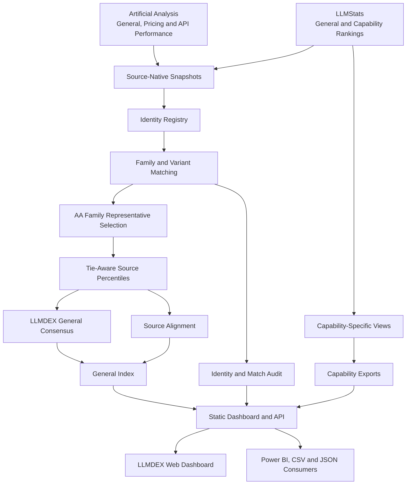

<div align="center">

# 🧠 LLMDEX

### Multi-Source LLM Intelligence, Capability Analytics and Model Discovery

LLMDEX combines model intelligence, pricing, speed, capability benchmarks, historical trends and transparent multi-source scoring into one interactive dashboard.

[](https://llmdex.onrender.com/)
[](https://github.com/ArnavMurdande/LLMDEX)
[](https://www.python.org/)
[](https://developer.mozilla.org/en-US/docs/Web/JavaScript)
[](https://github.com/ArnavMurdande/LLMDEX/actions)

<br />

[🌐 Live Website](https://llmdex.onrender.com/) •
[📊 Methodology](METHODOLOGY.md) •
[📖 Data Dictionary](docs/DATA_DICTIONARY.md) •
[🔌 API](#-api-endpoints) •
[⚙️ Local Setup](#️-running-locally)

</div>

---

## 🌐 Live Dashboard

Explore the deployed LLMDEX platform:

### [https://llmdex.onrender.com/](https://llmdex.onrender.com/)

LLMDEX provides:

- General LLM performance rankings
- Price-performance and efficiency analysis
- Coding, mathematics and reasoning leaderboards
- Writing, research and long-context rankings
- Tool-calling capability analysis
- Family-level multi-source consensus scoring
- Historical model and score trends
- Open-weight and proprietary model comparisons
- Identity-matching and source-quality transparency
- Gemini-powered model guidance
- CSV and JSON exports for Power BI and external analysis

---

## 📌 What Is LLMDEX?

LLMDEX is a multi-source LLM intelligence and capability analytics platform.

It combines observations from different public benchmarking sources while keeping their original methodologies separate. It then performs deterministic model-family matching and produces a transparent percentile-based consensus score where sufficient source coverage exists.

LLMDEX is designed around one central principle:

> Different benchmark providers should be compared carefully, not treated as though their raw scores use the same scale.

LLMDEX therefore does **not** directly average raw Artificial Analysis and LLMStats scores.

Instead, it:

1. Preserves source-native observations.
2. Matches models using canonical family and variant identities.
3. Selects one Artificial Analysis representative configuration per family.
4. Converts confidently matched source rankings into tie-aware percentiles.
5. Calculates an equal-weight family-level consensus score.
6. Publishes source coverage, identity status and methodology metadata.

LLMDEX does not independently benchmark models. Every published observation retains its source, provenance and update metadata.

---

## ✨ Key Features

### 📊 Multi-Source Intelligence

LLMDEX combines:

- Artificial Analysis general intelligence observations
- Artificial Analysis pricing and API performance
- LLMStats general rankings
- LLMStats capability-specific rankings
- Historical family and source snapshots
- Experimental community sentiment signals

Each observation remains associated with its original source and methodology.

### 🧮 Transparent LLMDEX Consensus Score

The General Consensus score is calculated only for confidently matched model families present in both supported general-ranking sources.

```text
LLMDEX Score =
    50% × Artificial Analysis family percentile
  + 50% × LLMStats General family percentile
```

Raw Artificial Analysis and LLMStats scores are never directly averaged.

### 🤝 Source Alignment

LLMDEX also publishes how closely the two sources rank the same model family.

```text
Source Alignment =
    100 − |AA percentile − LLMStats percentile|
```

Source Alignment is informational only.

It does **not** increase, decrease or otherwise modify the LLMDEX Score or model rank.

### 🧬 Family-Aware Model Identity

Model names often differ across benchmark providers.

LLMDEX resolves these differences using:

- Canonical model-family IDs
- Variant IDs
- Provider aliases
- Version-aware parsing
- Exact-name matching
- Deterministic alias matching
- Manual identity overrides
- Match-audit records
- Review-only fuzzy candidates

Uncertain fuzzy matches are never automatically promoted into the public consensus.

### 🧠 Capability Leaderboards

LLMDEX provides source-native rankings for:

- 💻 Coding
- ➗ Mathematics
- 🧩 Reasoning
- ✍️ Writing
- 🔎 Research
- 📚 Long Context
- 🛠️ Tool Calling

Capability rankings remain native to LLMStats and are not mixed with unrelated Artificial Analysis metrics.

### 💰 Value and Efficiency Analysis

The dashboard helps compare models using:

- Intelligence
- Input-token pricing
- Output-token pricing
- Generation speed
- Context-window size
- Price-performance balance
- Efficiency rankings
- Open-weight availability

### 📈 Historical Analytics

LLMDEX maintains structured historical datasets for:

- Family score movement
- Ranking changes
- Model growth
- Source snapshots
- Consensus history
- Source health
- Release metadata

### 🤖 Gemini Advisor

The LLMDEX Advisor uses Gemini when the remote advisor service is available.

It can help users:

- Select models for a specific use case
- Compare cost and performance
- Understand leaderboard differences
- Evaluate open-weight alternatives
- Interpret source disagreement
- Explore capability-specific options

When Gemini is unavailable, LLMDEX falls back to deterministic analysis using the published dataset.

### 📤 Analysis-Ready Exports

Processed CSV and JSON files are published for:

- Power BI
- Python
- Pandas
- Excel
- Research workflows
- Custom dashboards
- Downstream APIs

---

## 🗂️ What Powers Each View?

| LLMDEX View | Primary Source or Method |
|---|---|
| General Performance | Artificial Analysis |
| Value | Artificial Analysis |
| Efficiency | Artificial Analysis |
| Coding | LLMStats |
| Mathematics | LLMStats |
| Reasoning | LLMStats |
| Writing | LLMStats |
| Research | LLMStats |
| Long Context | LLMStats |
| Tool Calling | LLMStats |
| General Consensus | LLMDEX family-level percentile methodology |
| Source Alignment | Difference between matched source percentiles |
| Sentiment | Experimental model-specific community signals |

LLMDEX does not independently execute or reproduce the upstream benchmark suites.

---

## 🛡️ Methodology and Safety Rules

LLMDEX follows strict publication rules:

- Missing values remain `null`.
- Missing values are never converted into zero.
- A model absent from one source remains visible.
- Missing source coverage does not create a score penalty.
- Raw Artificial Analysis and LLMStats scores are never averaged.
- Only confidently matched model families receive a consensus score.
- Fuzzy matches remain review candidates.
- Unresolved identities are excluded from consensus scoring.
- Only the selected Artificial Analysis family representative displays the numeric family score.
- Other configurations remain available as family variants.
- Failed live scrapes preserve the last-known-good source snapshot.
- SOTA and Open-Weights SOTA badges require valid identity and consensus data.
- Source Alignment never affects ranking.
- Experimental sentiment never affects ranking.
- Every published observation retains provenance and source metadata.

Read the complete methodology:

- [METHODOLOGY.md](METHODOLOGY.md)
- [Identity Matching](docs/IDENTITY_MATCHING.md)
- [Data Sources](docs/DATA_SOURCES.md)
- [Audit Documentation](docs/AUDIT.md)

---

## 🏷️ Model Coverage States

LLMDEX uses clear public-facing coverage states:

| Status | Meaning |
|---|---|
| `TWO-SOURCE` | The family is confidently matched across both general-ranking sources |
| `AA ONLY` | The model is currently available only through Artificial Analysis |
| `LLMSTATS ONLY` | The model is currently available only through LLMStats |
| `MATCH PENDING` | A possible cross-source identity exists but has not been verified |
| `FAMILY VARIANT` | Another configuration of a family whose score appears on the selected representative |

Internal review states remain available in audit datasets instead of being exposed as confusing leaderboard labels.

---

## 🏗️ Architecture



Text representation:

```text
Artificial Analysis expanded table ─┐
                                    ├─ Identity Registry ─ Family Representatives
LLMStats public server HTML ────────┘                         │
                                                              ▼
                                            Tie-Aware Source Percentiles
                                                              │
                         ┌────────────────────────────────────┼──────────────┐
                         ▼                                    ▼              ▼
                 General Index                     Capability Views    Quality/Audit
                 JSON + CSV                        JSON + CSV           JSON + CSV
                         │                                    │              │
                         └────────────────────────────────────┴──────────────┘
                                                              │
                                                     Static Dashboard/API
```

---

## 🧱 Technology Stack

### Backend and Data Pipeline

- Python
- Structured CSV and JSON publication
- Deterministic identity matching
- Percentile-based consensus scoring
- Historical snapshot generation
- Publication validation
- Gemini Advisor integration

### Frontend

- HTML5
- CSS3
- Vanilla JavaScript
- Responsive layouts
- WebGL and Three.js-powered PixelBlast effects
- Accessible navigation and interactions

### Automation and Deployment

- GitHub Actions
- Render
- Automated tests
- Scheduled source collection
- Historical data generation
- Publication validation
- Automated deployment

### Analytics Integrations

- Power BI
- CSV exports
- JSON APIs
- Pandas-compatible datasets

---

## 📁 Project Structure

```text
LLMDEX/
├── .github/
│   ├── dependabot.yml
│   └── workflows/
│       ├── ci.yml
│       └── update.yml
│
├── data/
│   ├── capabilities/
│   ├── cleaned/
│   ├── families/
│   ├── history/
│   ├── identity/
│   ├── index/
│   ├── methodology/
│   ├── quality/
│   └── raw_snapshot/
│
├── docs/
│   ├── AUDIT.md
│   ├── DATA_DICTIONARY.md
│   ├── DATA_SOURCES.md
│   ├── DEPLOYMENT.md
│   ├── IDENTITY_MATCHING.md
│   ├── POWER_BI.md
│   └── TROUBLESHOOTING.md
│
├── frontend-effects/
│   ├── PixelBlast.css
│   ├── PixelBlast.jsx
│   └── index.jsx
│
├── pipeline/
│   ├── consensus.py
│   ├── gemini_advisor.py
│   ├── identity.py
│   ├── merge_data.py
│   ├── multisource.py
│   ├── run_pipeline.py
│   ├── scoring.py
│   └── validate_publication.py
│
├── scraper/
│   ├── contracts.py
│   ├── scrape_artificialanalysis.py
│   └── scrape_llmstats.py
│
├── tests/
│   ├── fixtures/
│   ├── test_frontend_contracts.py
│   ├── test_identity_consensus.py
│   ├── test_llmstats_scraper.py
│   └── test_regressions.py
│
├── website/
│   ├── app.js
│   ├── effects.js
│   ├── index.html
│   ├── pixelblast.bundle.css
│   ├── pixelblast.bundle.js
│   └── styles.css
│
├── api_server.py
├── METHODOLOGY.md
├── requirements.txt
├── package.json
└── README.md
```

### Important Modules

| Module | Responsibility |
|---|---|
| `scraper/` | Source contracts and policy-aware source extraction |
| `pipeline/identity.py` | Family parsing, aliases and deterministic matching |
| `pipeline/consensus.py` | Representatives, percentiles, scores and statuses |
| `pipeline/multisource.py` | Stable publication, history, quality and exports |
| `pipeline/gemini_advisor.py` | Gemini-based model guidance |
| `api_server.py` | Static application server, Advisor and read APIs |
| `website/` | Responsive public dashboard |
| `data/` | Published data contracts and historical outputs |
| `tests/` | Pipeline, identity, scraper and frontend contract tests |

---

## ⚙️ Running Locally

### Prerequisites

Install:

- Python 3.11 or newer
- Git
- Node.js and npm
- Google Chrome for the Artificial Analysis collection stage

### 1. Clone the Repository

```powershell
git clone https://github.com/ArnavMurdande/LLMDEX.git
cd LLMDEX
```

### 2. Create a Virtual Environment

```powershell
python -m venv .venv
.\.venv\Scripts\Activate.ps1
```

If PowerShell blocks activation:

```powershell
Set-ExecutionPolicy -Scope Process -ExecutionPolicy Bypass
.\.venv\Scripts\Activate.ps1
```

### 3. Install Python Dependencies

```powershell
python -m pip install --upgrade pip
python -m pip install -r requirements.txt
```

### 4. Install Frontend-Effect Dependencies

```powershell
npm install
```

### 5. Run the Automated Tests

```powershell
$env:PYTHONPATH = "."
python -m unittest discover -s tests -v
```

### 6. Build the PixelBlast Frontend Bundle

```powershell
npm run build:effects
```

### 7. Build the Processed Datasets

```powershell
python -m pipeline.multisource
```

### 8. Start the Application

```powershell
python api_server.py
```

Open:

```text
http://localhost:8080
```

---

## 🔄 Running the Full Pipeline

Run Artificial Analysis, LLMStats and optional sentiment collection:

```powershell
python pipeline\run_pipeline.py --with-sentiment
```

Generate historical family datasets:

```powershell
python pipeline\build_family_history.py
```

Validate the complete publication:

```powershell
python pipeline\validate_publication.py
```

The Artificial Analysis stage requires Chrome.

LLMStats extraction uses public server-rendered pages declared in:

```text
data/methodology/source_config.json
```

The pipeline does not depend on undocumented private API routes or bypass source-verification controls.

---

## 🔌 API Endpoints

When `api_server.py` is running:

| Method | Endpoint | Description |
|---|---|---|
| `GET` | `/api/leaderboards/general` | General leaderboard |
| `GET` | `/api/leaderboards/general?sort=llmdex` | General leaderboard sorted by LLMDEX Score |
| `GET` | `/api/leaderboards/capabilities/{capability}` | Capability-specific leaderboard |
| `GET` | `/api/models/{family_id}` | Model-family details |
| `GET` | `/api/models/{family_id}/history` | Historical family data |
| `GET` | `/api/data-quality` | Source-health and publication-quality data |
| `GET` | `/api/methodology` | Methodology metadata |
| `POST` | `/api/advisor` | Gemini Advisor request |
| `GET` | `/api/health` | Application and advisor health |

Published API responses may include:

- Generation timestamp
- Methodology version
- Score version
- Source update time
- Source health
- Provenance
- Identity status
- Coverage state

---

## 📤 Data Exports

### General Index

```text
data/index/latest.csv
data/index/latest.json
```

### Capability Data

```text
data/capabilities/latest.csv
data/capabilities/latest.json
data/capabilities/coding.json
data/capabilities/math.json
data/capabilities/reasoning.json
data/capabilities/writing.json
data/capabilities/research.json
data/capabilities/long_context.json
data/capabilities/tool_calling.json
```

### Historical Data

```text
data/history/family_snapshots.csv
data/history/model_snapshots.csv
data/history/score_history.csv
data/history/source_snapshots.csv
```

### Identity and Audit Data

```text
data/identity/model_registry.json
data/identity/match_audit.csv
data/identity/match_audit.json
data/identity/unresolved_matches.json
```

### Quality and Methodology

```text
data/quality/latest.json
data/methodology/benchmark_registry.json
data/methodology/publication_manifest.json
data/methodology/score_versions.json
data/methodology/source_config.json
```

---

## 📊 Power BI Integration

Power BI should consume the processed LLMDEX exports rather than recreating the scoring methodology in DAX.

Recommended source:

```text
https://llmdex.onrender.com/data/index/latest.csv
```

This stable URL can be connected through Power BI's Web connector and refreshed after the LLMDEX data pipeline updates.

Suggested Power BI datasets include:

- General model index
- Family history
- Score history
- Capability rankings
- Source alignment
- Provider comparisons
- Price-performance analysis
- Open-weight versus proprietary analysis

See [docs/POWER_BI.md](docs/POWER_BI.md) for implementation guidance.

---

## 🔐 Environment Variables

Environment variables are optional unless the related integration is enabled.

| Variable | Purpose |
|---|---|
| `GEMINI_API_KEY` | Primary Gemini Advisor key |
| `GEMINI_ADVISOR_KEY_1..5` | Gemini Advisor key rotation |
| `GEMINI_SENTIMENT_KEY_1..4` | Experimental sentiment collection |
| `X_BEARER_TOKEN` | Optional X sentiment integration |
| `PORT` | Application port, default `8080` |

PowerShell example:

```powershell
$env:GEMINI_API_KEY = "your-key"
$env:PORT = "8080"
python api_server.py
```

Secrets remain server-side and must never be committed to the repository or written into public datasets.

---

## 🤖 Automation

The repository includes GitHub Actions workflows for:

- Dependency validation
- Automated testing
- Source collection
- Identity matching
- Consensus scoring
- Historical snapshots
- Publication validation
- Diagnostics
- Dataset updates
- Deployment workflows

The update workflow commits generated files only when their content changes.

Relevant workflow:

```text
.github/workflows/update.yml
```

---

## 🚀 Deployment

The public application is deployed on Render:

### [https://llmdex.onrender.com/](https://llmdex.onrender.com/)

A typical deployment flow is:

```text
Source Update
      ↓
Identity Matching
      ↓
Consensus Calculation
      ↓
Publication Validation
      ↓
CSV and JSON Generation
      ↓
Commit to Main
      ↓
Render Deployment
```

For a normal manual deployment:

```powershell
git status
git add .
git commit -m "Describe your update"
git push origin main
```

Then monitor:

- GitHub → Actions
- Render → LLMDEX → Deploys

Never commit API keys, downloaded temporary files, local backup folders or `node_modules`.

---

## ✅ Testing

Run the complete Python test suite:

```powershell
python -m unittest discover -s tests -v
```

Validate JavaScript syntax:

```powershell
node --check website/app.js
node --check website/effects.js
```

Build the frontend effects:

```powershell
npm run build:effects
```

Validate the published data:

```powershell
python pipeline\validate_publication.py
```

Check staged changes before committing:

```powershell
git diff --cached --check
git status
```

---

## ⚠️ Limitations

- LLMDEX does not independently execute every upstream benchmark.
- Upstream sources (Artificial Analysis and LLMStats) may differ in methodology, coverage, providers, versions, and update time.
- Output throughput (generated tokens per second) is not the same as latency or time to first token.
- Listed context-window capacity is not the same as actual long-context benchmark retrieval or reasoning quality.
- Missing values remain unavailable (`null`) and are never treated as zero.
- LLMDEX depends on the availability and consistency of upstream public sources.
- Capability rankings may use different benchmark compositions from general rankings.
- A model may appear under different names or configurations across providers.
- Consensus scores are limited to confidently matched model families.
- Source percentiles are relative to the currently matched publication universe.
- Historical comparisons may be affected by upstream methodology changes.
- Sentiment data is experimental and should not be treated as a benchmark.
- A high Source Alignment score means sources rank a family similarly; it does not prove model quality or benchmark correctness.
- Public benchmark rankings should not be treated as the only factor when selecting a production model.

---

## 🗺️ Roadmap

Potential future improvements include:

- Additional trusted benchmark sources
- Expanded model identity registry
- More historical visualizations
- Provider-level analytics
- Benchmark-level drill-downs
- Improved open-weight model discovery
- Downloadable comparison reports
- Embedded Power BI analytics
- Advisor-generated model shortlists
- Cost estimation for production workloads
- User-selectable consensus weighting
- More transparent source-change detection

---

## 📚 Documentation

- [Methodology](METHODOLOGY.md)
- [Data Dictionary](docs/DATA_DICTIONARY.md)
- [Data Sources](docs/DATA_SOURCES.md)
- [Identity Matching](docs/IDENTITY_MATCHING.md)
- [Deployment](docs/DEPLOYMENT.md)
- [Power BI](docs/POWER_BI.md)
- [Troubleshooting](docs/TROUBLESHOOTING.md)
- [Audit](docs/AUDIT.md)

---

## 📖 Data Sources and Attribution

- **Artificial Analysis** ([https://artificialanalysis.ai/](https://artificialanalysis.ai/)) supplies general intelligence, model pricing, generation throughput, latency, and API-performance observations.
- **LLMStats** ([https://llm-stats.com/](https://llm-stats.com/)) supplies general and capability-specific leaderboard observations.
- LLMDEX independently processes, links, and presents these observations.
- LLMDEX is an independent analytics project and is not affiliated with, endorsed by, or sponsored by Artificial Analysis or LLMStats.

All trademarks, product names and source data remain the property of their respective owners.

---

## 📜 Licensing Scope

- Original LLMDEX software codebase and documentation are MIT licensed.
- Third-party benchmark observations and source metrics are excluded from the software license.
- See [NOTICE.md](NOTICE.md) for complete licensing scope and attribution terms.

---

## 🤝 Contributing

Contributions, corrections and methodology discussions are welcome.

To contribute:

1. Fork the repository.
2. Create a feature branch.
3. Make and test your changes.
4. Run publication validation.
5. Submit a pull request with a clear description.

```powershell
git checkout -b feature/your-feature
python -m unittest discover -s tests -v
git push origin feature/your-feature
```

For model-identity corrections, include:

- Source model name
- Provider
- Model family
- Version or release identifier
- Supporting source URL
- Reason for the proposed match

---

## 👨‍💻 Author

Developed by **Arnav Murdande**.

[](https://github.com/ArnavMurdande)
[](https://llmdex.onrender.com/)

---

## 📄 License

See [LICENSE](LICENSE) for software license text and [NOTICE.md](NOTICE.md) for third-party data licensing scope.

---

<div align="center">

### ⭐ Star the repository if LLMDEX helps you compare and understand modern language models.

[🌐 Open LLMDEX](https://llmdex.onrender.com/) •
[🐙 View on GitHub](https://github.com/ArnavMurdande/LLMDEX)

</div>
